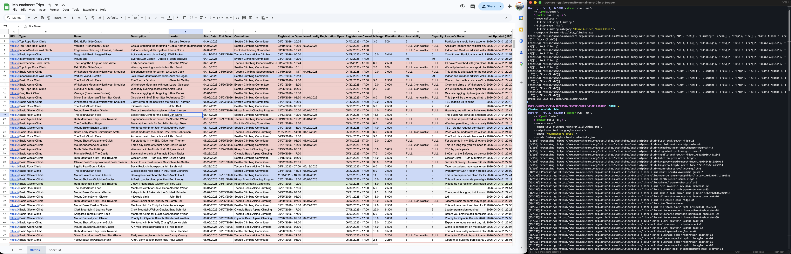

# Mountaineers Climb Scraper

## Summary

Parse important information from a list of [Mountaineers.org](https://www.mountaineers.org/activities/activities) climb URLs and write the data to Google Sheets

> ⚠️ **Please use this responsibly and DO NOT abuse their servers with aggressive scraping!** ⚠️

## Requirements

| Requirement  | Description |
| ------------- | ------------- |
| Docker  | For running Python  |
| Google Cloud Account | For access to Sheets & Drive APIs |
| Google Sheets Spreadsheet | As a landing place for the parsed data

## Example Results

<p>
    <center>
        </td>
    </center>
</p>


## Configuration

The script accepts the following CLI arguments:

| Argument              | Required? | Description                                                                                 |
|-----------------------|-----------|---------------------------------------------------------------------------------------------|
| --file                | Yes       | Path to the text file containing a list of URLs to scrape                                    |
| --output              | No        | Output destination: `csv` (default) or `google-sheets`                                      |
| --output-file-name    | No        | Output CSV file name (default: `output.csv`)                                                 |
| --sheet               | Yes*      | Google Sheet name (required if `--output google-sheets`)                                     |
| --creds               | Yes*      | Path to Google service account JSON file (required if `--output google-sheets`)              |


## Instructions for CSV Output (Default)

1. Update `urls.txt` with a list of the climbs you would like to scrape and parse into the CSV file.
2. Run the script (CSV is now the default output, so --output csv is optional):

```bash
docker run --rm \
    -v $(pwd):/data \
    $(docker build -q .) \
    --file /data/urls.txt \
    --output-file-name /data/output.csv
```

3. Review the generated CSV file. The last column indicates when the data was last updated.

## Instructions for Google Sheets Output

1. Create a Google Cloud account & project: https://console.cloud.google.com/
2. Enable the Google Sheets & Drive APIs for the project. Both APIs are free to use within quota restrictions for which this script should abide. 
    * https://console.cloud.google.com/apis/library/sheets.googleapis.com
    * https://console.cloud.google.com/apis/library/drive.googleapis.com
3. Create a service account for the project: https://console.cloud.google.com/iam-admin/serviceaccounts
4. Add a new private key to the service account
5. Download the key credentials for the service account and name the file `service_account.json` 
6. Create a new spreadsheet on Google Sheets
7. Share the spreadsheet with the service account email found within the downloaded JSON file: `client_email`
8. Update `urls.txt` with a list of the climbs you would like to scrape and parse into the spreadsheet
9. Run the script:

```bash
docker run --rm \
    -v $(pwd):/data \
    $(docker build -q .) \
    --file /data/urls.txt \
    --output google-sheets \
    --sheet "Mountaineers Trips" \
    --creds /data/service_account.json
```

10. Review the data collected in Google Sheets. The last column indicates when the data was last updated.


## Useful Conditional Formatting rules:

1. Mark all FULL climbs as red:
    ```
    Apply to Range: A2:Z995
    Format rules if: Custom formula is
    =ISNUMBER(SEARCH("FULL",$M2))
    ```

2. Mark all open registration climbs as blue
    ```
    Apply to Range: A2:Z995
    Format rules if: Custom formula is
    =DATEVALUE(TRIM(MID($H2,6,FIND(" at",$H2)-6))) <= TODAY()
    ```

3. Mark all Foothills climbs as green
    ```
    Apply to Range: A2:Z995
    Format rules if: Custom formula is
    =ISNUMBER(SEARCH("Foothills",$G2))
    ```
