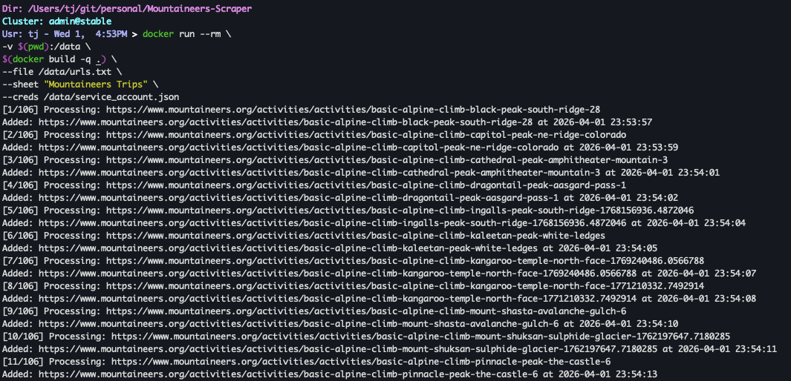
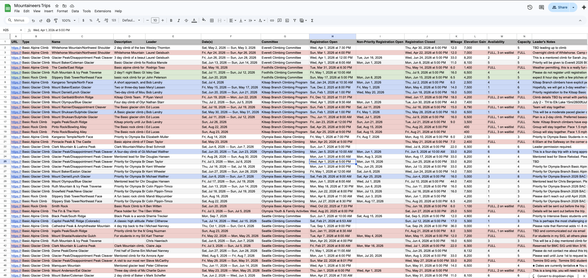

# Mountaineers Scraper

## Summary

This tool allows you to parse important information from a list of [Mountaineers.org](https://www.mountaineers.org/) climb URLs and write it to Google Sheets. 

> ⚠️ **Please use this responsibly and DO NOT abuse their servers with aggressive scraping!** ⚠️

## Requirements

| Requirement  | Description |
| ------------- | ------------- |
| Docker  | For running Python  |
| Google Cloud Account | For access to Sheets & Drive APIs |
| Google Sheets Spreadsheet | As a landing place for the parsed data

## Example Results

<p>
    <center>
        </td>
        </td>
    </center>
</p>

## Instructions

1. Create a Google Cloud account & project: https://console.cloud.google.com/
2. Enable the Google Sheets & Drive APIs for the project
    * https://console.cloud.google.com/apis/library/sheets.googleapis.com
    * https://console.cloud.google.com/apis/library/drive.googleapis.com
3. Create a service account for the project: https://console.cloud.google.com/iam-admin/serviceaccounts
4. Add a new private key to the service account
5. Download the key credentials for the service account and name the file `service_account.json` 
6. Create a new spreadsheet on Google Sheets
7. Share the spreadsheet with the service account email found in downloaded JSON field: client_email
8. Update `urls.txt` with a list of the climbs you would like to scrape and parse into the spreadsheet
9. Run the script
    ```bash
    docker run --rm \
    -v $(pwd):/data \
    mountaineers-scraper \
    --file /data/urls.txt \
    --sheet "Mountaineers Trips" \
    --creds /data/service_account.json
    ```
10. Review the data collected in Google Sheets. The URL field should be treated as a _primary key_ for the data allowing you to run the script repeatedly across time to update the data. The last column should indicate when the data was last updated.

## Useful Conditional Formatting rules:

1. Mark all FULL climbs as red:
    ```
    Apply to Range: A2:Z995
    Format rules if: Custom formula is
    =ISNUMBER(SEARCH("FULL",$M2))
    ```

2. Mark all open registration climbs as blue
    ```
    Apply to Range: A2:Z995
    Format rules if: Custom formula is
    =DATEVALUE(TRIM(MID($H2,6,FIND(" at",$H2)-6))) <= TODAY()
    ```

3. Mark all Foothills climbs as green
    ```
    Apply to Range: A2:Z995
    Format rules if: Custom formula is
    =ISNUMBER(SEARCH("Foothills",$G2))
    ```